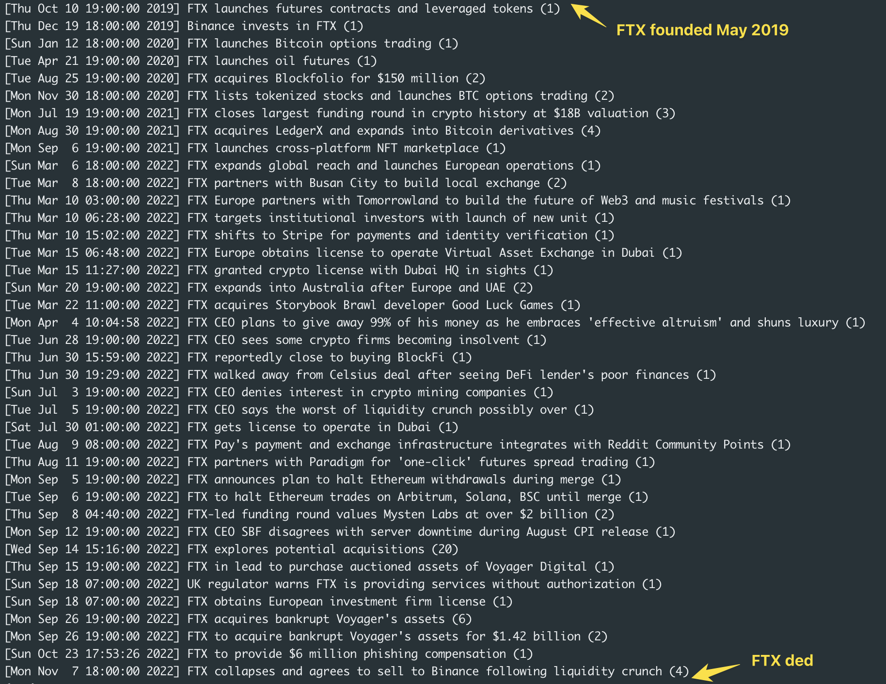

# GPT For You

A python script that queries the [Diffbot Knowledge Graph](https://www.diffbot.com/products/knowledge-graph/) for news and summarizes the top line takeaways with citations. 

```
[
  {
    "name": "Twitter's Disagreement with EU on Disinformation Code",
    "date": 1686061842000,
    "citationIds": [
      "ART51264025820" # https://nationalpost.com/news/twitter-has-chosen-confrontation-by-pulling-out-of-disinformation-code-eu
    ]
  },
  {
    "name": "Senators Warning Twitter and Elon Musk over Data Privacy",
    "date": 1685951340000,
    "citationIds": [
      "ART144302563391" #https://abcnews.go.com/Business/senators-warn-twitter-elon-musk-alleged-disregard-data/story?id=99838319
    ]
  }
]
```

Read more at ___

## Table of Contents

- [Installation](#installation)
- [Usage](#usage)
- [Support](#support)

## Installation

Clone to a project directory and install some basic dependencies. You may wish to instantiate a venv.

```sh
# Optional
python3 -m venv venv
python3 venv/bin/activate

# Install Requirements
pip3 install -r requirements.txt
```

Add your [Diffbot token](https://app.diffbot.com/get-started) and [OpenAI auth](https://platform.openai.com) into the corresponding variables in `generate_foryou.py`

## Usage

Run `generate_foryou.py` with a single argument - the name of a company. By default, this script will query the Diffbot KG for the last 30 days of news on this company and generate top lines on politics related headlines in the form of a JSON array with citations. 

```sh
python3 generate_foryou.py Tiktok
python3 generate_foryou.py Twitter
```

Customize the prompt to your liking to curate your own custom For You output.

`generate_timeline.py` also uses the same single argument but uses the top line workflow to generate an event timeline of a company's history. Like this:



Careful! This will take a long time and eat up lots of requests from Diffbot and OpenAI!

## Support

Open an issue, or reach out to me at [jerome@diffbot.com](mailto:jerome@diffbot.com) if you have any questions. 